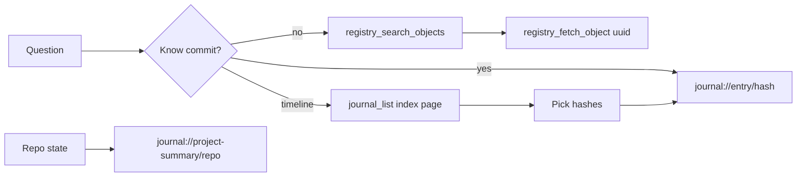

# MCP Journal Read Path — Proposal

**Status:** Draft for review  
**Author:** Guillermo + agent analysis (May 2026)  
**Related:** `docs/TARTARUS_IMPLEMENTATION_PLAN.md`, `src/modules/journal/tools.ts`, `src/server.ts`

## Problem Statement

Tartarus MCP is built to be **robust** (pagination, truncation warnings, registry, resources) but **journal reads fail in practice** as entries grow meatier.

Measured on live `journal.db`:

| Scenario | Result |
|----------|--------|
| `journal_list_by_repository({ repository: "tartarus", limit: 5 })` | **42 KiB** payload → truncated to ~9 KiB |
| Average Tartarus entry (why + what + decisions) | ~**3.1 KB** |
| Largest Jobilla entries | **14 KB+** |
| Total journal rows | **132** (Jobilla 48, Tartarus 34) |
| Entry 0 v2 (`sections_json`) migrated repos | **2 of N** — Tartarus still on legacy fallback |

Agents cannot reliably browse even **5 entries** despite pagination. The cap is not Cloud Gemini’s 1M context — it is **payload shape + self-imposed 9 KiB tool limits + client-side MCP clipping**.

## Goals

1. **Readable journal at scale** — 80+ entries discoverable without context explosion.
2. **One mental model** — same pattern as media library and Kronus oracle: *index → search → fetch one*.
3. **Backward compatible** — existing tools keep working; safer defaults only.
4. **Honest docs** — README and MCP instructions match behavior and tool counts.

## Non-Goals (this proposal)

- Hosted multi-tenant MCP SaaS (see DEPLOY-001 in implementation plan).
- Replacing SQLite or moving journal to Supabase for MCP reads.
- Loading full branch history into a single agent turn (even with 1M tokens, that is bad RAG).

---

## Architecture: Three Layers of Limits

Agents and operators should understand these separately:

| Layer | Limit | Who controls it |
|-------|-------|-----------------|
| **Model context** | ~1M tokens (Gemini 3.x) | Provider |
| **MCP client** | Undocumented; large tool output → temp files / truncation | Cursor, Gemini CLI, Claude Desktop |
| **Tartarus MCP** | **9 KiB / ~200 lines** on tool text (`MAX_SAFE_BYTES`) | Us — `src/modules/journal/tools.ts` |

**Who can use MCP today:** one operator, one machine, stdio → local `journal.db`. Cloud Gemini cannot read the journal unless we expose HTTP + auth (partial bridge exists at `mcp-server/http-server.js`).

**Design principle:** MCP tool responses are **pointers and indexes**. Full text lives in resources, registry fetch, or authenticated HTTP — not in bulk list tools.

---

## Root Causes (code-grounded)

### 1. List tools are not lists

`formatEntrySummary()` returns full `why`, `what_changed`, `decisions`, `files_changed` for every row. Only `raw_agent_report` is excluded. Pagination cannot help when one row ≈ one payload.

**Anchor:** `src/modules/journal/tools.ts` — `formatEntrySummary`, `journal_list_by_*`.

### 2. Entry 0 “shallow” is a lie for most repos

`journal://project-summary/{repo}` calls `getShallowView()` which requires `sections_json`. If missing, handler falls back to **full legacy row** (Tartarus Entry 0 is ~tens of KB JSON).

**Anchor:** `src/modules/journal/db/database.ts` — `getShallowView`; resource handler ~3507.

### 3. Good patterns exist but are under-documented

Already correct elsewhere:

- **`journal_list_media_library`** — metadata + `download_url` via `TARTARUS_URL`
- **`registry_search_objects` + `registry_fetch_object`** — UUID drill-down
- **`journal://entry/{hash}`** — single entry, no tool truncation in resource path
- **`kronus_ask`** — index + internal search/fetch (4K char cap on fetch)

MCP `tartarus` prompt still recommends `journal_list_by_repository({ limit: 10 })` as the primary read path.

### 4. README drift

Documented: 22 tools, 26 resources. Actual: **~35 tools**, **~32 resources**, plus `git_read`, 8× `ai_*`, journal visuals, Notion resources.

---

## Proposed Solution

### Phase A — Safe defaults (ship first, ~1 day)

**A1. `detail_level` on journal list tools**

Add to `journal_list_by_repository` and `journal_list_by_branch`:

```ts
detail_level: z.enum(["index", "standard", "full"]).default("index")
```

| Level | Fields returned per entry |
|-------|---------------------------|
| **index** (default) | `commit_hash`, `repository`, `branch`, `date`, `summary`, `uuid` (from registry), `attachment_count`, `has_attachments` |
| **standard** | index + clipped `why` (300 chars), `technologies` |
| **full** | current behavior (discourage; point to resource) |

Implementation: refactor `formatEntrySummary(entry, opts)` to respect level; batch UUID lookup via existing `getObjectUUIDs`.

**A2. Fix Entry 0 shallow fallback**

When `sections_json` is absent, return a **tier-1 clip** instead of legacy dump:

- Include: `repository`, `summary`, `purpose`, `status`, `technologies`, `architecture` (each capped ~2K)
- Exclude: `file_structure`, `extended_notes`, `data_flow`, full history columns
- Add `_view: "legacy_clipped"` so agents know shape

**A3. Update MCP instructions**

In `src/server.ts` instructions and `tartarus` prompt (`tools.ts`):

```
Discover  → registry_search_objects OR journal_list_* (detail_level: "index")
Drill     → journal://entry/{hash} OR registry_fetch_object({ uuid })
Overview  → journal://project-summary/{repo}  (never /deep unless debugging)
Avoid     → journal_list_* with detail_level: "full" for N > 3
```

**A4. Optional filters on list tools**

- `since` / `until` (ISO date strings, filter on `journal_entries.date`)
- `branch` already on branch tool; add to repository tool as optional filter

**Acceptance (Phase A):**

- [ ] `journal_list_by_repository({ repository: "tartarus", limit: 20, detail_level: "index" })` stays under 9 KiB
- [ ] `journal://project-summary/tartarus` returns < 15 KiB without `/deep`
- [ ] MCP integration tests still pass; add one test asserting index payload size
- [ ] `npm run build` at repo root

---

### Phase B — Resource parity (~1–2 days)

**B1. Paginated entries resource**

```
journal://entries/{repository}?detail=index&limit=20&offset=0&branch=main
```

Same shape as index list tool; no `truncateOutput` on resources (client may still clip — keep pages small).

**B2. Entry resource hints**

In `journal://entry/{hash}` JSON, add:

```json
{
  "registry_uuid": "...",
  "estimated_chars": 4200,
  "read_via": "journal://entry/{hash}?include_raw_report=true"
}
```

**Acceptance (Phase B):**

- [ ] Agent can paginate via ReadMcpResource without calling list tool
- [ ] Document URIs in server instructions (Cursor ListMcpResources may be empty)

---

### Phase C — Entry 0 migration (~ongoing / process)

**C1.** Run Repository overview analyze / `journal_update_project_technical` for Tartarus, Jobilla, and other active repos so `sections_json` exists.

**C2.** Shallow resource uses true v2 flat view; legacy clip path only for unmigrated repos.

**Acceptance (Phase C):**

- [ ] Tartarus `repository_overviews.sections_json` populated
- [ ] Shallow vs deep size ratio documented (target: shallow < 5K, deep unbounded)

---

### Phase D — Docs & operator hygiene

**D1.** Update root `README.md`: tool/resource counts, read path diagram, `git_read` + `ai_*` tools.

**D2.** Add “MCP read contract” subsection to `working-with-tartarus` skill.

**D3.** Optional: env `MCP_MAX_TOOL_BYTES` to override 9000 for clients that tolerate more (default unchanged).

---

## Recommended Agent Read Flow (target contract)



**Rule of thumb:** never pull more than **3 full entries** per turn unless the user explicitly asks for an export.

---

## Risks & Trade-offs

| Risk | Mitigation |
|------|------------|
| Breaking agents that relied on full bodies in list output | `detail_level: "full"` preserves old behavior; document migration |
| Index rows lack `summary` when null | Fall back to first 120 chars of `why`; encourage backfill |
| Resources still clipped by Cursor | Keep pages at 20 index rows; HTTP export later if needed |
| Entry 0 clip loses nuance | Deep resource + fetch by UUID unchanged for debugging |

---

## Open Questions (for review)

1. **Default `detail_level`:** `index` (proposed) vs `standard` — how much do you want in list without an extra fetch?
2. **UUID on every index row:** requires registry backfill — acceptable dependency?
3. **HTTP bulk export:** worth a `GET /api/mcp/journal/{repo}/entries.ndjson` for power users, or overkill for now?
4. **Hosted MCP:** defer until DEPLOY-001, or spec auth + read-only subset now?
5. **kronus_ask fetch cap (4K):** raise to 8K in parallel, or keep oracle lean?

---

## Suggested Implementation Order

1. Phase A1 + A2 + A3 (immediate usability win)
2. Phase A4 (filters) if you often ask “what changed last week”
3. Phase B (resource parity)
4. Phase C (Entry 0 migration — can run in parallel with coding)
5. Phase D (README + skills)

---

## Success Metrics

- Index list of 20 entries: **< 9 KiB** (tool path)
- Tartarus shallow overview: **< 15 KiB**
- Agent can answer “what happened in the last 5 tartarus commits” in **≤ 3 MCP calls** (index + 2 entry fetches)
- README tool count matches `registerTool` count in `src/`
